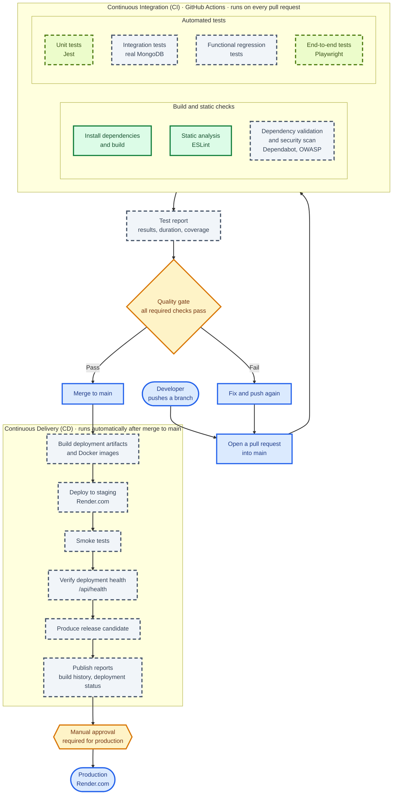
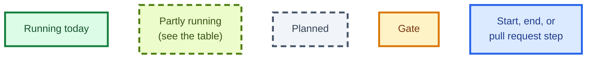

# PEERS: Peer Evaluation System

Productionization, Automated Testing, and CI/CD for the PEERS Peer Evaluation System

Date: 09/20/2026
Status: In Progress — Milestone 1 (Assessment & Planning)

A web-based platform for professors to manage peer evaluations in team-based courses: create and
manage student rosters, assign students to courses/teams, trigger email invitations, and receive
structured, professor-friendly reports with both numeric and textual feedback.

This capstone is a **continuation** of a previous KSU senior capstone project. The application
itself already exists (source: [`SameerHerm/ProjectPeerEvaluation`](https://github.com/SameerHerm/ProjectPeerEvaluation)).
This project's focus is **not new features** — it's transforming the inherited app into a
professionally engineered, production-ready product: automated testing, containerization,
deployment automation, and CI/CD.

---

## Objectives

- Assess the inherited application's architecture, tech stack, and existing test coverage
- Build a full automated testing pyramid: unit, integration, functional regression, and
  end-to-end tests
- Containerize the application (Docker/Docker Compose) and finalize a repeatable local dev setup
- Stand up a Continuous Integration pipeline (build, static analysis, tests, quality gates)
- Stand up a Continuous Delivery pipeline (staging deployment to Render.com, smoke tests) —
  production deployment remains a manual approval step, out of scope
- Maintain a Requirements Traceability Matrix linking business requirements to automated tests
- Document architecture, testing strategy, Docker setup, and release procedures

Explicitly **out of scope**: redesigning the UI, new application features, replacing the tech
stack, a commercial production hosting environment, or migrating databases.

---

## Deployment

**Render.com only** — this is the sponsor's explicit choice; other platforms (Vercel, Railway,
etc.) are not used for this project even though `DEPLOYMENT_GUIDE.md` documents them as
historical alternatives. Continuous Integration already runs on every pull request (see
[CI/CD Pipeline](#cicd-pipeline)). Automated staging deployment is planned for Milestone 3, and
production deployment always stays a manual sponsor approval.

---

## CI/CD Pipeline

Every change reaches `main` through a pull request. Continuous Integration (CI) runs automatically
on GitHub Actions for every pull request, and a change that fails a required check cannot be
merged. After merge, Continuous Delivery (CD) automatically builds, deploys to staging on
Render.com, and verifies the release. Production deployment is the one manual step: it requires
sponsor approval.



**Legend**



The quality gate is enforced today. Production approval is manual.

| Stage | What it does | Owner | Status and target (per the Gantt chart) |
|---|---|---|---|
| Install dependencies and build | `npm ci` and the production build | M1 / M4 | Live (`.github/workflows/ci.yml`) |
| Workflow lint | `actionlint` checks the workflow files themselves | M1 / M4 | Live |
| Unit tests | Jest and React Testing Library for the frontend; Jest for the backend | M4 / M5 | Frontend live. Backend planned, weeks of 5–12 Oct |
| Integration tests | Frontend, backend, database, authentication, and email, against a real MongoDB | M4 / M5 | Planned, weeks of 12–19 Oct |
| Functional regression tests | One automated test per critical business workflow | M5 | Planned, week of 19 Oct |
| End-to-end tests | Playwright: student and instructor workflows | M4 / M5 | Smoke test live. Workflows planned, week of 26 Oct |
| Static analysis | ESLint (`npm run lint`) | M1 / M4 | Live |
| Dependency validation and security scan | Dependabot and OWASP Dependency Check | M3 | Planned, week of 19 Oct |
| Test report | Executed, passed, and failed tests, duration, and coverage | M4 | Planned, week of 16 Nov |
| Quality gate | Branch ruleset on `main`: a pull request and passing required checks before merge | M1 | Live. Required checks grow as jobs are added, week of 26 Oct |
| Build artifacts and Docker images | Build the deployment artifacts and the frontend and backend images | M2 | Planned, week of 2 Nov |
| Staging deploy | Automatic deploy to Render.com staging | M2 | Planned, week of 9 Nov |
| Smoke tests | Verify the deployment after each release | M5 | Planned, week of 9 Nov |
| Deployment health check | Poll `/api/health` after deploy | M1 | Planned, week of 16 Nov |
| Release candidate | Produce a release candidate after staging passes | M1 | Planned, week of 16 Nov |
| Build and deployment reports | Build history and deployment status | M2 | Planned, week of 16 Nov |
| Production deploy | Manual sponsor approval. Not automated | Sponsor | By design |

---

## Project Timeline and Milestones

📅 **Milestone 1 — Assessment & Planning** — 14 Sep – 04 Oct 2026 (review 28 Sep)
- Application architecture review, technical assessment report
- Requirements validation, critical workflow identification, Requirements Traceability Matrix
- Development environment validation, containerization assessment
- CI/CD architecture design, automated testing strategy

📅 **Milestone 2 — Quality Automation** — 05 Oct – 01 Nov 2026 (review 26 Oct)
- Development environment finalized, containerization completed
- Unit, integration, functional regression, and end-to-end tests implemented
- Continuous Integration pipeline operational with automated quality gates

📅 **Milestone 3 — Productionization** — 02 Nov – 06 Dec 2026 (review 30 Nov, final 06 Dec)
- Continuous Delivery pipeline, automated staging deployment, smoke testing
- Automated test/build reporting, finalized technical documentation
- Final system demonstration and repository delivery

Full per-person, per-week breakdown (sponsor-approved):


---

## Getting Started (For New Users)

### Prerequisites

1. **Install [Node.js and npm](https://nodejs.org/)** — Node 24 (npm 11 is included). The required
   version is pinned in `.nvmrc`; with [nvm](https://github.com/nvm-sh/nvm) run `nvm use`. Other
   Node/npm versions can generate a different `package-lock.json`, which then fails `npm ci` in CI.
2. **Install [Git](https://git-scm.com/)**
3. A code editor, e.g. [VS Code](https://code.visualstudio.com/)

### Setup Steps

1. **Clone the repository**
   ```bash
   git clone https://github.com/IT7993-FALL-2026-PEERS/ProjectPeerEvaluation.git
   ```
2. **Install dependencies** (installs both frontend and backend)
   ```bash
   npm run setup
   ```
3. **Configure environment variables** — copy `src/backend/.env.example` to `src/backend/.env`
   and fill in `MONGODB_URI` and SMTP settings.
4. **Start the application**
   ```bash
   npm run dev
   ```
5. **Access the app**
   - Frontend: [http://localhost:3000](http://localhost:3000)
   - Backend API: [http://localhost:5000](http://localhost:5000)

### Available Scripts

- `npm run dev` — start both frontend and backend servers simultaneously
- `npm run setup` — install dependencies for both frontend and backend
- `npm run start:backend` / `npm run start:frontend` — start one side only
- `npm test` — frontend unit tests (Jest + React Testing Library)
- `npm run test:e2e` — end-to-end tests (Playwright)

Not yet on `main` as of this writing:
- `npm run test:backend` — backend unit tests

### Continuous Integration

GitHub Actions (`.github/workflows/ci.yml`) runs on every pull request to `main` and on every push
to `main`. It has four jobs: frontend lint, tests and build, a backend syntax check, the Playwright
smoke test, and a lint of the workflow files (`actionlint`). The `main` branch ruleset requires a
pull request and all four checks to pass before merging. To reproduce the checks locally, use
Node 24 (see `.nvmrc`) and run:

```bash
npm ci
npm run lint
npm test -- --watchAll=false
npm run build
npm run test:e2e
```

Commit `package.json` and `package-lock.json` together. `npm ci` fails if they are out of sync.

If a pull request shows "Expected — Waiting for status to be reported" on a check, its branch is
behind `main` and does not have the latest workflow. Update the branch (the **Update branch**
button on the pull request, or `gh pr update-branch <number>`) and the check will run.

### Troubleshooting

- Missing dependencies: re-run `npm run setup`.
- `npm ci` says the lock file is out of sync: check `node -v` (should be 24) and `npm -v`, then
  reinstall with `npm install` on the pinned Node version and commit both files.
- Ports 3000/5000 in use: close conflicting apps or change the port in config.
- Email sending issues: check `src/backend/.env` SMTP settings.

---

## Team

| Role | Name | Responsibilities | Contact |
|---|---|---|---|
| Sponsor | Dr. Geetika Vyas | Repository access, functional guidance, requirements validation, milestone reviews | gvyas@kennesaw.edu |
| M1 | Donald Gobin | CI/CD architecture & design, branch governance, CI pipeline, CD pipeline oversight, release procedures, final repository delivery | dgobin@students.kennesaw.edu |
| M2 | Aaron Simpson | Dev environment finalization, Docker/Docker Compose containerization, CD pipeline (artifact/image builds, staging deploy), build/deployment reporting | asimps57@students.kennesaw.edu |
| M3 | Laeticia Neno Aloyem | Requirements validation & Requirements Traceability Matrix, security scanning (Dependabot, OWASP Dependency Check), technical assessment / testing-strategy / architecture documentation | laloyem@students.kennesaw.edu |
| Team Leader / M4 | Khoa Ho | Frontend unit & integration tests, end-to-end student workflow (Playwright), automated test reporting | kho6@students.kennesaw.edu |
| M5 | Kylee Gipson | Backend unit & integration tests, functional regression tests, end-to-end instructor workflow, post-deploy smoke tests | kgipson5@students.kennesaw.edu |
| Advisor / Instructor | Ying Xie | Facilitate progress; advise on planning and project management | yxie2@kennesaw.view.usg.edu |
| Capstone Program Support | Taylor Cuffie | CCSE capstone program coordination; CC'd on sponsor emails; escalation point | tcuffie1@kennesaw.edu |

Primary contact for inquiries: Team Leader (Khoa Ho).

---

## Collaboration & Communication

- Channel: Microsoft Teams
- **Weekly sponsor update:** the team meets weekly with the sponsor (Dr. Vyas). Most or all of the
  team attends, with video on, and the Team Leader leads. Each update covers completed work,
  obstacles, and the plan for the following week, with a summary slide where it helps.
- Weekly async check-ins track task-by-task progress against the project Gantt chart
- **Sponsor correspondence:** direct email with the sponsor is fine, but always **CC** (carbon
  copy, the "CC" field in your email) the Program Coordinator and the faculty advisor on every
  message.
- **Escalation:** unresolved issues go to the Program Coordinator and the Director of Partnerships.
- Blockers are raised at the weekly sponsor update and at milestone review meetings with the
  sponsor and advisor

---

## Repository Structure

```
.github/workflows/  # CI workflow (ci.yml)
.nvmrc              # pinned Node version (24)
src/
  frontend/       # React 19 (Create React App)
  backend/        # Express + MongoDB (Mongoose); own package.json
e2e/              # Playwright end-to-end tests
docs/
  requirements/
  architecture/          # system and database documentation
  testing-strategy/      # frontend testing strategy
  technical-assessment/  # Milestone 1 reviews (containerization and test coverage, and more)
  meeting-notes/
  research-report/
  user-manual/
  gantt/                 # sponsor-approved schedule
  deployment-review.md   # current deployment flow and the gap to automated staging
DEPLOYMENT_GUIDE.md      # historical deployment notes (Render.com is the one in use)
docker-compose.yml  # currently non-functional — see docs/technical-assessment; being
                     # rebuilt as part of Milestone 2 containerization work
```

---

## Tech Stack

- **Frontend**: React 19, Create React App, MUI, React Router, Formik/Yup, Chart.js/Recharts
- **Backend**: Node.js, Express, MongoDB via Mongoose, JWT auth, Nodemailer
- **Testing**: Jest + React Testing Library (frontend unit), Playwright (end-to-end); backend unit
  tests are planned (Milestone 2)
- **CI/CD**: GitHub Actions (CI is live), deploying to Render.com (CD is planned, Milestone 3)
- **Containerization**: Docker / Docker Compose (planned, see Milestone 2; the current
  `docker-compose.yml` does not work)

---

## Security & Privacy

- Restrict access to student data to authorized users only
- HTTPS for all traffic; protect credentials and tokens
- Avoid sending sensitive data in plain text emails
- Comply with institutional policies and applicable regulations (e.g., FERPA)

---

## Contributing

- Never push directly to `main`. Use a feature branch and open a pull request into `main`
- All four CI checks must pass before a pull request can be merged (see
  [Continuous Integration](#continuous-integration))
- Reference the relevant Milestone/task in PR descriptions
- Keep commit messages descriptive
- Keep secrets out of the repository. Never commit a real `.env` file
- Merged branches are deleted automatically

---

Questions or suggestions? Open an issue in this repository or contact the Team Leader.
