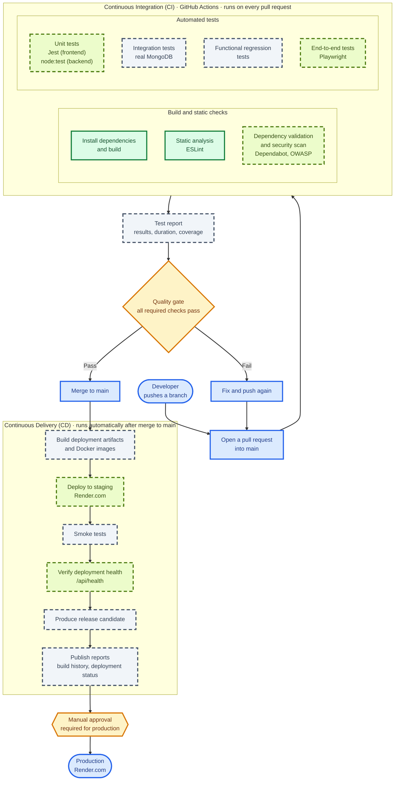
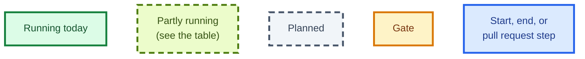
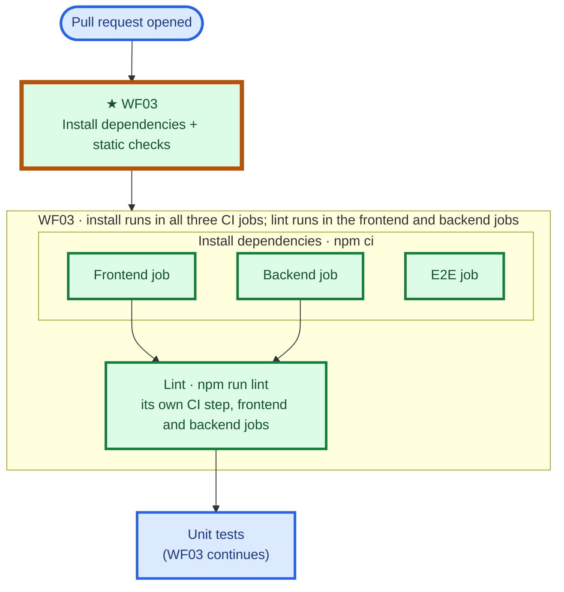

# PEERS: Peer Evaluation System

Productionization, Automated Testing, and CI/CD for the PEERS Peer Evaluation System

Last updated: 09/30/2026
Status: Milestone 1 (Assessment & Planning) signed off by the sponsor on 28 Sep 2026 · Milestone 2
(Quality Automation) starts 5 Oct

A web-based platform for professors to manage peer evaluations in team-based courses: create and
manage student rosters, assign students to courses/teams, trigger email invitations, and receive
structured, professor-friendly reports with both numeric and textual feedback.

This capstone is a **continuation** of a previous KSU senior capstone project. The application
itself already exists (source: [`SameerHerm/ProjectPeerEvaluation`](https://github.com/SameerHerm/ProjectPeerEvaluation)).
This project's focus is **not new features** — it's transforming the inherited app into a
professionally engineered, production-ready product: automated testing, containerization,
deployment automation, and CI/CD.

---

## Objectives

- Assess the inherited application's architecture, tech stack, and existing test coverage
- Build a full automated testing pyramid: unit, integration, functional regression, and
  end-to-end tests
- Containerize the application (Docker/Docker Compose) and finalize a repeatable local dev setup
- Stand up a Continuous Integration pipeline (build, static analysis, tests, quality gates)
- Stand up a Continuous Delivery pipeline (staging deployment to Render.com, smoke tests) —
  production deployment remains a manual approval step, out of scope
- Maintain a Requirements Traceability Matrix linking business requirements to automated tests
- Document architecture, testing strategy, Docker setup, and release procedures

Explicitly **out of scope**: redesigning the UI, new application features, replacing the tech
stack, a commercial production hosting environment, or migrating databases.

---

## Deployment

**Render.com only** — proposed by the team and approved by the sponsor; other platforms (Vercel, Railway,
etc.) are not used for this project even though `DEPLOYMENT_GUIDE.md` documents them as
historical alternatives. Continuous Integration runs on every pull request (see
[CI/CD Pipeline](#cicd-pipeline)). A staging environment is live on Render, defined in `render.yaml`:
once CI passes on `main`, Render deploys the frontend and backend automatically. Staging uses
MongoDB Atlas and a Mailtrap test inbox, so no real student ever receives an email from it. A
CI-driven deploy step with smoke tests comes in Milestone 3, and production deployment always
stays a manual sponsor approval.

---

## CI/CD Pipeline

Every change reaches `main` through a pull request. Continuous Integration (CI) runs automatically
on GitHub Actions for every pull request, and a change that fails a required check cannot be
merged. After merge, Continuous Delivery (CD) automatically builds, deploys to staging on
Render.com, and verifies the release. Production deployment is the one manual step: it requires
sponsor approval.


```mermaid
flowchart TB
    DEV(["Developer<br/>pushes a branch"]) --> PR["Open a pull request<br/>into main"]

    subgraph CI["Continuous Integration (CI) · GitHub Actions · runs on every pull request"]
        direction LR
        subgraph STATIC["Build and static checks"]
            direction TB
            BUILD_APP["Install dependencies<br/>and build"]
            LINT["Static analysis<br/>ESLint"]
            SEC["Dependency validation<br/>and security scan<br/>Dependabot, OWASP"]
        end
        subgraph TESTS["Automated tests"]
            direction TB
            UNIT["Unit tests<br/>Jest (frontend)<br/>node:test (backend)"]
            INTEG["Integration tests<br/>real MongoDB"]
            REG["Functional regression<br/>tests"]
            E2E["End-to-end tests<br/>Playwright"]
        end
    end

    PR --> CI
    CI --> REPORT["Test report<br/>results, duration, coverage"]
    REPORT --> GATE{"Quality gate<br/>all required checks pass"}
    GATE -- "Fail" --> FIX["Fix and push again"]
    FIX --> PR
    GATE -- "Pass" --> MERGE["Merge to main"]

    subgraph CD["Continuous Delivery (CD) · runs automatically after merge to main"]
        direction TB
        ARTIFACTS["Build deployment artifacts<br/>and Docker images"]
        STG["Deploy to staging<br/>Render.com"]
        SMOKE["Smoke tests"]
        HEALTH["Verify deployment health<br/>/api/health"]
        RC["Produce release candidate"]
        DREPORT["Publish reports<br/>build history, deployment status"]
        ARTIFACTS --> STG --> SMOKE --> HEALTH --> RC --> DREPORT
    end

    MERGE --> ARTIFACTS
    DREPORT --> APPROVE{{"Manual approval<br/>required for production"}}
    APPROVE --> PROD(["Production<br/>Render.com"])

    classDef done fill:#dcfce7,stroke:#15803d,color:#14532d,stroke-width:3px
    classDef partial fill:#ecfccb,stroke:#4d7c0f,color:#365314,stroke-width:3px,stroke-dasharray: 9 6
    classDef planned fill:#f1f5f9,stroke:#475569,color:#334155,stroke-width:3px,stroke-dasharray: 9 6
    classDef gate fill:#fef3c7,stroke:#d97706,color:#78350f,stroke-width:3px
    classDef endpoint fill:#dbeafe,stroke:#2563eb,color:#1e3a8a,stroke-width:3px
    linkStyle default stroke-width:2px

    class BUILD_APP,LINT done
    class UNIT,E2E,SEC,STG,HEALTH partial
    class INTEG,REG,REPORT,ARTIFACTS,SMOKE,RC,DREPORT planned
    class GATE,APPROVE gate
    class DEV,PROD,PR,MERGE,FIX endpoint
```

**Legend**


```mermaid
flowchart LR
    L1["Running today"] ~~~ L2["Partly running<br/>(see the table)"] ~~~ L3["Planned"] ~~~ L4["Gate"] ~~~ L5["Start, end, or<br/>pull request step"]

    classDef done fill:#dcfce7,stroke:#15803d,color:#14532d,stroke-width:3px
    classDef partial fill:#ecfccb,stroke:#4d7c0f,color:#365314,stroke-width:3px,stroke-dasharray: 9 6
    classDef planned fill:#f1f5f9,stroke:#475569,color:#334155,stroke-width:3px,stroke-dasharray: 9 6
    classDef gate fill:#fef3c7,stroke:#d97706,color:#78350f,stroke-width:3px
    classDef endpoint fill:#dbeafe,stroke:#2563eb,color:#1e3a8a,stroke-width:3px

    class L1 done
    class L2 partial
    class L3 planned
    class L4 gate
    class L5 endpoint
```

The quality gate is enforced today. Production approval is manual.

| Stage | What it does | Owner | Status and target (per the Gantt chart) |
|---|---|---|---|
| Install dependencies and build | `npm ci` and the production build | M1 / M4 | Live (`.github/workflows/ci.yml`) |
| Workflow lint | `actionlint` checks the workflow files themselves | M1 / M4 | Live |
| Unit tests | Jest and React Testing Library for the frontend; Node's built-in test runner (`node:test`) for the backend | M4 / M5 | Live for both in CI on every pull request. Coverage still growing, weeks of 5–12 Oct |
| Integration tests | Frontend, backend, database, authentication, and email, against a real MongoDB and an isolated email transport (never real student inboxes) | M4 / M5 | Planned, weeks of 12–19 Oct |
| Functional regression tests | One automated test per critical business workflow | M5 | Planned, week of 19 Oct |
| End-to-end tests | Playwright: student and instructor workflows | M4 / M5 | Smoke test live. Workflows planned, week of 26 Oct |
| Static analysis | ESLint: frontend (`npm run lint`) and backend (`cd src/backend && npm run lint`) | M1 / M4 | Live |
| Dependency validation and security scan | Dependabot, OWASP Dependency Check, CodeQL code scanning, secret scanning | M3 | Partly live, report-only: Dependabot raises alerts and opens weekly update pull requests (`.github/dependabot.yml`); OWASP Dependency-Check runs on every pull request, on `main`, and weekly (`.github/workflows/security.yml`); CodeQL (GitHub default setup) scans the code on every pull request; secret scanning and push protection are on. Triage, failing on high-severity findings, and making it a required check planned, week of 19 Oct |
| Test report | Executed, passed, and failed tests, duration, and coverage | M4 | Planned, week of 16 Nov |
| Quality gate | `main-protection` ruleset: a pull request, passing required checks and an up-to-date branch before merge. No approval required, so authors merge their own pull requests. No bypass, and direct pushes are rejected | M1 | Live. Required checks grow as jobs are added, week of 26 Oct |
| Build artifacts and Docker images | Build the deployment artifacts and the frontend and backend images for the exact commit that passed CI | M2 | Planned, week of 2 Nov |
| Staging deploy | Automatic deploy to Render.com staging | M2 | Partly live: Render deploys `main` after CI passes (`render.yaml`). CI-driven deploy of the tested commit planned, week of 9 Nov |
| Smoke tests | Verify the deployment after each release | M5 | Planned, week of 9 Nov |
| Deployment health check | Poll `/api/health` after deploy | M1 | Partly live: Render checks `/api/health` before switching traffic to a new deploy, and the endpoint reports the deployed commit. CI polling after deploy planned, week of 16 Nov |
| Release candidate | Produce a release candidate after staging passes | M1 | Planned, week of 16 Nov |
| Build and deployment reports | Build history and deployment status | M2 | Planned, week of 16 Nov |
| Production deploy | Manual sponsor approval. Not automated | Sponsor | By design |

### Detailed workflow reference (WF01–WF12)

Every pipeline stage above as one numbered flow, start to finish. WF01–WF12 are our own stage IDs
for this diagram only — not the same numbering as any external document or an FR/requirement ID.


```mermaid
flowchart TB
    DEV(["Developer"]) --> WF01["WF01 Fresh checkout →<br/>configure → install → ready"]
    WF01 --> PR["Open / update pull request"]
    PR --> WF02

    subgraph CI["CONTINUOUS INTEGRATION · runs on every pull request"]
        direction TB
        WF02["WF02 Test setup<br/>isolated DB + fixtures"]
        WF03["★ WF03 Install deps + static checks (ESLint)"]
        UNIT["Unit tests<br/>frontend + backend live · coverage growing"]
        INTEG["Integration tests"]
        REG["Functional regression tests"]
        BUILD["Build"]
        E2E["End-to-end tests<br/>smoke live · workflows planned"]
        WF05["WF05 Dependency & security scan<br/>report-only live · gate planned"]
        WF06["WF06 Publish results<br/>Playwright reports live · full coverage planned"]
        WF02 --> WF03 --> UNIT --> INTEG --> REG --> BUILD --> E2E --> WF05 --> WF06
    end

    WF06 --> GATE{"WF04 Quality gate<br/>all required checks pass"}
    GATE -- "Fail: merge blocked" --> FIX["Fix and push again"]
    FIX --> PR
    GATE -- "Pass" --> MERGE["Qualifying merge to main"]
    MERGE --> WF07

    subgraph CD["CONTINUOUS DELIVERY · runs after merge to main"]
        direction TB
        WF07["WF07 Build artifacts and version images"]
        WF08["WF08 Deploy to staging · readiness check · smoke tests"]
        WF09{"WF09 Deploy or smoke test failed?"}
        BLOCK["Block promotion · follow recovery procedure"]
        WF10["WF10 Tag release candidate · retain version and evidence"]
        WF07 --> WF08 --> WF09
        WF09 -- "Yes" --> BLOCK
        WF09 -- "No" --> WF10
    end

    WF10 --> APPROVE{{"WF12 Manual sponsor<br/>approval required"}}
    APPROVE --> PROD(["Production · Render.com"])
    PROD -.-> WF11{{"WF11 Rollback<br/>if approved"}}
    WF11 -.->|"restore known-good release"| PROD

    classDef done fill:#dcfce7,stroke:#15803d,color:#14532d,stroke-width:3px
    classDef highlight fill:#dcfce7,stroke:#b45309,color:#14532d,stroke-width:5px
    classDef partial fill:#ecfccb,stroke:#4d7c0f,color:#365314,stroke-width:3px,stroke-dasharray: 9 6
    classDef planned fill:#f1f5f9,stroke:#475569,color:#334155,stroke-width:3px,stroke-dasharray: 9 6
    classDef gate fill:#fef3c7,stroke:#d97706,color:#78350f,stroke-width:3px
    classDef endpoint fill:#dbeafe,stroke:#2563eb,color:#1e3a8a,stroke-width:3px

    class BUILD done
    class WF03 highlight
    class UNIT,E2E,WF05,WF06 partial
    class WF01,WF02,INTEG,REG,WF07,WF08,WF09,BLOCK,WF10,WF11 planned
    class GATE,APPROVE,WF09 gate
    class DEV,PROD,PR,MERGE,FIX endpoint
```

★ = the most recently completed stage.

#### WF03 close-up


```mermaid
flowchart TB
    PR(["Pull request opened"]) --> WF03["★ WF03<br/>Install dependencies + static checks"]

    subgraph WF03BOX["WF03 · install runs in all three CI jobs; lint runs in the frontend and backend jobs"]
        direction TB
        subgraph INSTALL["Install dependencies · npm ci"]
            direction LR
            FE["Frontend job"]
            BE["Backend job"]
            E2E["E2E job"]
        end
        LINT["Lint · npm run lint<br/>its own CI step, frontend and backend jobs"]
        FE --> LINT
        BE --> LINT
    end

    WF03 --> WF03BOX
    LINT --> NEXT["Unit tests<br/>(WF03 continues)"]

    classDef done fill:#dcfce7,stroke:#15803d,color:#14532d,stroke-width:3px
    classDef highlight fill:#dcfce7,stroke:#b45309,color:#14532d,stroke-width:5px
    classDef endpoint fill:#dbeafe,stroke:#2563eb,color:#1e3a8a,stroke-width:3px

    class FE,BE,E2E,LINT done
    class PR,NEXT endpoint
    class WF03 highlight
```

---

## Project Timeline and Milestones

📅 **Milestone 1 — Assessment & Planning** — 14 Sep – 30 Sep 2026 (review 28 Sep: all nine
deliverables signed off by the sponsor)
- Application architecture review, technical assessment report
- Requirements validation, critical workflow identification, Requirements Traceability Matrix
- Development environment validation, containerization assessment
- CI/CD architecture design, automated testing strategy

📅 **Milestone 2 — Quality Automation** — 05 Oct – 01 Nov 2026 (review 26 Oct)
- Development environment finalized, containerization completed
- Unit, integration, functional regression, and end-to-end tests implemented
- Continuous Integration pipeline operational with automated quality gates

📅 **Milestone 3 — Productionization** — 02 Nov – 06 Dec 2026 (review 30 Nov, final 06 Dec)
- Continuous Delivery pipeline, automated staging deployment, smoke testing
- Automated test/build reporting, finalized technical documentation
- Final system demonstration and repository delivery

Full per-person, per-week breakdown (sponsor-approved):


---

## Getting Started (For New Users)

### Prerequisites

1. **Install [Node.js and npm](https://nodejs.org/)** — Node 24 (npm 11 is included). The required
   version is pinned in `.nvmrc`; with [nvm](https://github.com/nvm-sh/nvm) run `nvm use`. Other
   Node/npm versions can generate a different `package-lock.json`, which then fails `npm ci` in CI.
2. **Install [Git](https://git-scm.com/)**
3. **MongoDB 7** — the backend needs a running MongoDB. The easiest way is Docker:
   `docker run -d --name peers-dev-mongo -p 27017:27017 mongo:7` (after the first time,
   `docker start peers-dev-mongo`). A local MongoDB Community Server or a MongoDB Atlas
   connection string also works.
4. A code editor, e.g. [VS Code](https://code.visualstudio.com/)

### Setup Steps

1. **Clone the repository**
   ```bash
   git clone https://github.com/IT7993-FALL-2026-PEERS/ProjectPeerEvaluation.git
   ```
2. **Install dependencies** (installs both frontend and backend)
   ```bash
   npm run setup
   ```
3. **Configure environment variables** — copy `src/backend/.env.example` to `src/backend/.env`.
   It already points `MONGODB_URI` at `mongodb://localhost:27017/peer-eval`; change it only if
   you use Atlas. SMTP settings are needed only to send email, not to start the app.
   The real `.env` is never committed (it is git-ignored), so if a `git pull` removed yours,
   copy `.env.example` again.
4. **Start MongoDB** (see Prerequisites), then **start the application**
   ```bash
   npm run dev
   ```
5. **Access the app**
   - Frontend: [http://localhost:3000](http://localhost:3000)
   - Backend API: [http://localhost:5000](http://localhost:5000)

### Available Scripts

- `npm run dev` — start both frontend and backend servers simultaneously
- `npm run setup` — install dependencies for both frontend and backend
- `npm run start:backend` / `npm run start:frontend` — start one side only
- `npm test` — frontend unit tests (Jest + React Testing Library)
- `npm run test:e2e` — end-to-end tests (Playwright)
- `cd src/backend && npm test` — backend unit tests (`node:test`)

### Continuous Integration

GitHub Actions (`.github/workflows/ci.yml`) runs on every pull request to `main` and on every push
to `main`. It has four jobs: frontend lint, tests and build; backend lint, a syntax check and tests; the
Playwright smoke test; and a lint of the workflow files (`actionlint`). Two more scans run on every
pull request but do not block merging yet: the OWASP Dependency-Check scan
(`.github/workflows/security.yml`) and GitHub's CodeQL code scanning (default setup, no workflow
file), so a pull request normally shows eight checks. The `main` branch ruleset requires a pull request, the
four CI checks, and a branch that is up to date with `main`. To reproduce the checks locally, use
Node 24 (see `.nvmrc`) and run:

```bash
npm ci
npm run lint
npm test -- --watchAll=false
npm run build
npm run test:e2e
cd src/backend && npm run lint && npm test
```

Commit `package.json` and `package-lock.json` together. `npm ci` fails if they are out of sync.

If a pull request shows "Expected — Waiting for status to be reported" on a check, its branch is
behind `main` and does not have the latest workflow. Update the branch (the **Update branch**
button on the pull request, or `gh pr update-branch <number>`) and the check will run.

### Troubleshooting

- Missing dependencies: re-run `npm run setup`.
- Backend cannot connect to the database: start MongoDB (`docker start peers-dev-mongo`) and
  check `MONGODB_URI` in `src/backend/.env`.
- `npm ci` says the lock file is out of sync: check `node -v` (should be 24) and `npm -v`, then
  reinstall with `npm install` on the pinned Node version and commit both files.
- Ports 3000/5000 in use: close conflicting apps or change the port in config.
- Email sending issues: check `src/backend/.env` SMTP settings.

---

## Team

| Role | Name | Responsibilities | Contact |
|---|---|---|---|
| Sponsor | Dr. Geetika Vyas | Repository access, functional guidance, requirements validation, milestone reviews | gvyas@kennesaw.edu |
| M1 | Donald Gobin | CI/CD architecture & design, branch governance, CI pipeline, CD pipeline oversight, release procedures, final repository delivery | dgobin@students.kennesaw.edu |
| M2 | Aaron Simpson | Dev environment finalization, Docker/Docker Compose containerization, CD pipeline (artifact/image builds, staging deploy), build/deployment reporting | asimps57@students.kennesaw.edu |
| M3 | Laeticia Neno Aloyem | Requirements validation & Requirements Traceability Matrix, security scanning (Dependabot, OWASP Dependency Check), technical assessment / testing-strategy / architecture documentation | laloyem@students.kennesaw.edu |
| Team Leader / M4 | Khoa Ho | Frontend unit & integration tests, end-to-end student workflow (Playwright), automated test reporting | kho6@students.kennesaw.edu |
| M5 | Kylee Gipson | Backend unit & integration tests, functional regression tests, end-to-end instructor workflow, post-deploy smoke tests | kgipson5@students.kennesaw.edu |
| Advisor / Instructor | Ying Xie | Facilitate progress; advise on planning and project management | yxie2@kennesaw.view.usg.edu |
| Capstone Program Support | Taylor Cuffie | CCSE capstone program coordination; CC'd on sponsor emails; escalation point | tcuffie1@kennesaw.edu |

Primary contact for inquiries: Team Leader (Khoa Ho).

---

## Collaboration & Communication

- Channel: Microsoft Teams
- **Weekly sponsor update:** the team meets weekly with the sponsor (Dr. Vyas). Most or all of the
  team attends, with video on, and the Team Leader leads. Each update covers completed work,
  obstacles, and the plan for the following week, with a summary slide where it helps.
- Weekly async check-ins track task-by-task progress against the project Gantt chart
- **Sponsor correspondence:** direct email with the sponsor is fine, but always **CC** (carbon
  copy, the "CC" field in your email) the Program Coordinator and the faculty advisor on every
  message.
- **Escalation:** unresolved issues go to the Program Coordinator and the Director of Partnerships.
- Blockers are raised at the weekly sponsor update and at milestone review meetings with the
  sponsor and advisor

---

## Repository Structure

```
.github/
  workflows/             # ci.yml (CI), security.yml (OWASP Dependency-Check)
  dependabot.yml         # weekly dependency update pull requests
  CODEOWNERS             # reviewers requested automatically
  pull_request_template.md
.nvmrc                   # pinned Node version (24)
render.yaml              # Render staging services (Blueprint)
playwright.config.js
package.json             # frontend dependencies and root scripts (setup, dev, test, lint)
src/
  frontend/              # React 19 (Create React App)
  backend/               # Express + MongoDB (Mongoose); own package.json and tests/
e2e/                     # Playwright end-to-end tests
docs/
  requirements/          # requirements, critical workflows, traceability matrix (RTM)
  architecture/          # system architecture, API and database documentation
  testing-strategy/      # team testing strategy, frontend testing strategy
  technical-assessment/  # Milestone 1 technical assessment and reviews
  milestones/            # milestone progress reports
  meeting-notes/         # sponsor meeting decisions
  research-report/       # tech stack analysis
  user-manual/
  gantt/                 # sponsor-approved schedule
  deployment-review.md, dev-environment-review.md, containerization-recommendations.md
DEPLOYMENT_GUIDE.md      # historical deployment notes (Render.com is the one in use)
docker-compose.yml  # currently non-functional — see docs/technical-assessment; being
                     # rebuilt as part of Milestone 2 containerization work
```

---

## Tech Stack

- **Frontend**: React 19, Create React App, MUI, React Router, Axios
- **Backend**: Node.js, Express, MongoDB via Mongoose, JWT auth, Nodemailer
- **Testing**: Jest + React Testing Library (frontend unit), `node:test` (backend unit),
  Playwright (end-to-end)
- **CI/CD**: GitHub Actions (CI is live); Render.com staging deploys automatically after CI passes;
  a CI-driven delivery pipeline with smoke tests is planned for Milestone 3
- **Security scanning**: Dependabot, OWASP Dependency-Check, CodeQL, secret scanning
- **Containerization**: Docker / Docker Compose (planned, see Milestone 2; the current
  `docker-compose.yml` does not work)

---

## Security & Privacy

- Restrict access to student data to authorized users only
- HTTPS for all traffic; protect credentials and tokens
- Avoid sending sensitive data in plain text emails
- Comply with institutional policies and applicable regulations (e.g., FERPA)

---

## Contributing

- Never push directly to `main`. Use a feature branch and open a pull request into `main`
- Fill in the pull request template: what changed, the linked issue or Gantt task, and how it
  was tested
- All four CI checks must pass and the branch must be up to date with `main` before a pull
  request can be merged (see [Continuous Integration](#continuous-integration))
- CODEOWNERS requests a review automatically; an approval is not required, so authors merge
  their own pull requests once the checks pass
- Keep commit messages descriptive
- Keep secrets out of the repository. Never commit a real `.env` file
- Merged branches are deleted automatically

---

Questions or suggestions? Open an issue in this repository or contact the Team Leader.
