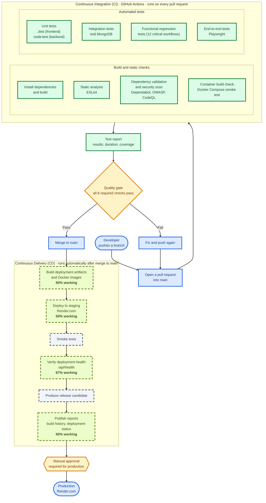
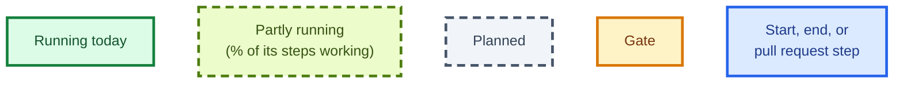
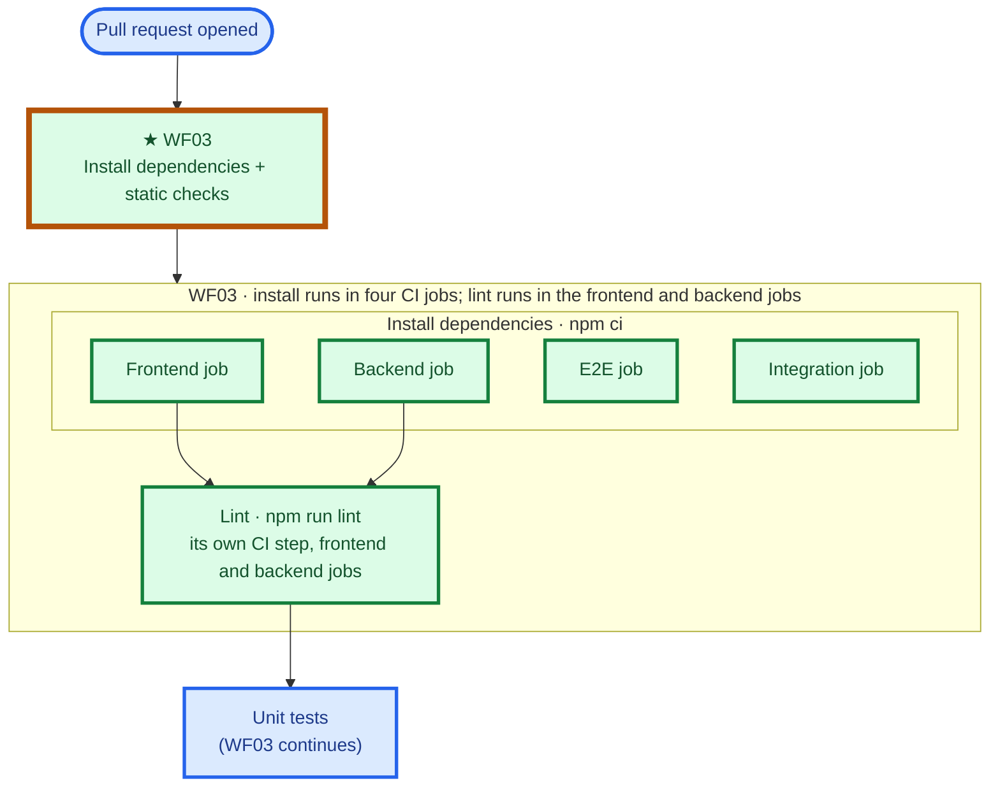
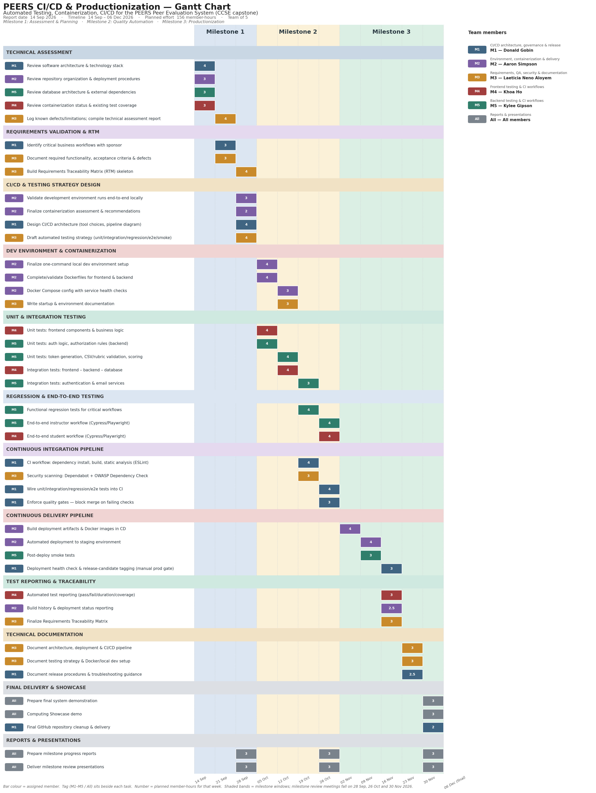

# PEERS: Peer Evaluation System

Productionization, Automated Testing, and CI/CD for the PEERS Peer Evaluation System

Last updated: 10/05/2026
Status: Milestone 1 (Assessment & Planning) signed off by the sponsor on 28 Sep 2026 · Milestone 2
(Quality Automation) began 5 Oct (review 26 Oct), and most of its test automation and CI gates already run

A web-based platform for professors to manage peer evaluations in team-based courses: create and
manage student rosters, assign students to courses/teams, trigger email invitations, and receive
structured, professor-friendly reports with both numeric and textual feedback.

This capstone is a **continuation** of a previous KSU senior capstone project. The application
itself already exists (source: [`SameerHerm/ProjectPeerEvaluation`](https://github.com/SameerHerm/ProjectPeerEvaluation)).
This project's focus is **not new features** — it's transforming the inherited app into a
professionally engineered, production-ready product: automated testing, containerization,
deployment automation, and CI/CD.

---

## Objectives

- Assess the inherited application's architecture, tech stack, and existing test coverage
- Build a full automated testing pyramid: unit, integration, functional regression, and
  end-to-end tests
- Containerize the application (Docker/Docker Compose) and finalize a repeatable local dev setup
- Stand up a Continuous Integration pipeline (build, static analysis, tests, quality gates)
- Stand up a Continuous Delivery pipeline (staging deployment to Render.com, smoke tests) —
  production deployment remains a manual approval step, out of scope
- Maintain a Requirements Traceability Matrix linking business requirements to automated tests
- Document architecture, testing strategy, Docker setup, and release procedures

Explicitly **out of scope**: redesigning the UI, new application features, replacing the tech
stack, a commercial production hosting environment, or migrating databases.

---

## Deployment

**Render.com only** — proposed by the team and approved by the sponsor; other platforms (Vercel, Railway,
etc.) are not used for this project even though `DEPLOYMENT_GUIDE.md` documents them as
historical alternatives. Continuous Integration runs on every pull request (see
[CI/CD Pipeline](#cicd-pipeline)). A staging environment is live on Render, defined in `render.yaml`:
once CI passes on `main`, `cd.yml` deploys that exact commit to the frontend and backend. Staging uses
MongoDB Atlas and a Mailtrap test inbox, so no real student ever receives an email from it; the backend
refuses to send through anything but the Mailtrap sandbox on staging (CICD-44). To keep
costs down, staging is switched off between checks and demos. A CI-driven deploy step with smoke
tests comes in Milestone 3, and production deployment always stays a manual sponsor approval.

---

## CI/CD Pipeline

Every change reaches `main` through a pull request. Continuous Integration (CI) runs automatically
on GitHub Actions for every pull request, and a change that fails a required check cannot be
merged. After merge, Continuous Delivery (CD) automatically builds, deploys to staging on
Render.com, and verifies the release. Production deployment is the one manual step: it requires
sponsor approval.


```mermaid
flowchart TB
    DEV(["Developer<br/>pushes a branch"]) --> PR["Open a pull request<br/>into main"]

    subgraph CI["Continuous Integration (CI) · GitHub Actions · runs on every pull request"]
        direction LR
        subgraph STATIC["Build and static checks"]
            direction TB
            BUILD_APP["Install dependencies<br/>and build"]
            LINT["Static analysis<br/>ESLint"]
            SEC["Dependency validation<br/>and security scan<br/>Dependabot, OWASP, CodeQL"]
            DOCKER["Container build check<br/>Docker Compose smoke test"]
        end
        subgraph TESTS["Automated tests"]
            direction TB
            UNIT["Unit tests<br/>Jest (frontend)<br/>node:test (backend)"]
            INTEG["Integration tests<br/>real MongoDB"]
            REG["Functional regression<br/>tests (12 critical workflows)"]
            E2E["End-to-end tests<br/>Playwright"]
        end
    end

    PR --> CI
    CI --> REPORT["Test report<br/>results, duration, coverage"]
    REPORT --> GATE{"Quality gate<br/>all 8 required checks pass"}
    GATE -- "Fail" --> FIX["Fix and push again"]
    FIX --> PR
    GATE -- "Pass" --> MERGE["Merge to main"]

    subgraph CD["Continuous Delivery (CD) · runs automatically after merge to main"]
        direction TB
        ARTIFACTS["Build deployment artifacts<br/>and Docker images<br/><b>50% working</b>"]
        STG["Deploy to staging<br/>Render.com<br/><b>50% working</b>"]
        SMOKE["Smoke tests"]
        HEALTH["Verify deployment health<br/>/api/health<br/><b>67% working</b>"]
        RC["Produce release candidate"]
        DREPORT["Publish reports<br/>build history, deployment status<br/><b>50% working</b>"]
        ARTIFACTS --> STG --> SMOKE --> HEALTH --> RC --> DREPORT
    end

    MERGE --> ARTIFACTS
    DREPORT --> APPROVE{{"Manual approval<br/>required for production"}}
    APPROVE --> PROD(["Production<br/>Render.com"])

    classDef done fill:#dcfce7,stroke:#15803d,color:#14532d,stroke-width:3px
    classDef partial fill:#ecfccb,stroke:#4d7c0f,color:#365314,stroke-width:3px,stroke-dasharray: 9 6
    classDef planned fill:#f1f5f9,stroke:#475569,color:#334155,stroke-width:3px,stroke-dasharray: 9 6
    classDef gate fill:#fef3c7,stroke:#d97706,color:#78350f,stroke-width:3px
    classDef endpoint fill:#dbeafe,stroke:#2563eb,color:#1e3a8a,stroke-width:3px
    linkStyle default stroke-width:2px

    class BUILD_APP,LINT,SEC,DOCKER,UNIT,INTEG,REG,E2E,REPORT done
    class ARTIFACTS,STG,HEALTH,DREPORT partial
    class SMOKE,RC planned
    class GATE,APPROVE gate
    class DEV,PROD,PR,MERGE,FIX endpoint
```

**Legend**


```mermaid
flowchart LR
    L1["Running today"] ~~~ L2["Partly running<br/>(% of its steps working)"] ~~~ L3["Planned"] ~~~ L4["Gate"] ~~~ L5["Start, end, or<br/>pull request step"]

    classDef done fill:#dcfce7,stroke:#15803d,color:#14532d,stroke-width:3px
    classDef partial fill:#ecfccb,stroke:#4d7c0f,color:#365314,stroke-width:3px,stroke-dasharray: 9 6
    classDef planned fill:#f1f5f9,stroke:#475569,color:#334155,stroke-width:3px,stroke-dasharray: 9 6
    classDef gate fill:#fef3c7,stroke:#d97706,color:#78350f,stroke-width:3px
    classDef endpoint fill:#dbeafe,stroke:#2563eb,color:#1e3a8a,stroke-width:3px

    class L1 done
    class L2 partial
    class L3 planned
    class L4 gate
    class L5 endpoint
```

The quality gate is enforced today. Production approval is manual.

**How the percentages are counted** (5 Oct 2026). A partly running box is scored as the steps that
run today out of the steps it needs. A step that is written but has never run counts as not done.
The numbers move as steps land.

| Box | Running today | Not yet | Score |
|---|---|---|---|
| Build deployment artifacts and Docker images (also WF07) | Both images build in CI; they start and pass a health check | Push to GitHub Container Registry tagged with the commit (written, never run); run automatically after merge on the tested commit | 2 of 4, 50% |
| Deploy to staging | Render deploys `main` after CI passes | CI deploys the exact tested commit | 1 of 2, 50% |
| Verify deployment health | `/api/health` reports the deployed commit; Render checks it before switching traffic | CI polls it after a deploy | 2 of 3, 67% |
| Publish reports | Build history of the last ten CI runs | Deployment status of a CD run (workflow written, no CD run yet) | 1 of 2, 50% |
| WF06 Publish results | Test summaries, coverage summaries, build history | Deployment status | 3 of 4, 75% |

| Stage | What it does | Owner | Status and target (per the Gantt chart) |
|---|---|---|---|
| Install dependencies and build | `npm ci` and the production build | M1 / M4 | Live (`.github/workflows/ci.yml`) |
| Workflow lint | `actionlint` checks the workflow files themselves | M1 / M4 | Live |
| Unit tests | Jest and React Testing Library for the frontend (230 tests); Node's built-in test runner (`node:test`) for the backend (317 tests) | M4 / M5 | Live for both in CI on every pull request. Coverage is measured on every pull request and gated by floors just below today's baseline (`coverage-floors.json`; backend about 66% of lines, frontend about 42%), and the floors only go up. The team's target is 70%; the backend is close, the frontend is not (`CourseManagement.js` is being split into tested components: its dialogs are covered, its data handling is not yet) |
| Integration tests | Backend, database, authentication, and email, against a real MongoDB that the tests start themselves and an isolated email transport (never real student inboxes) | M4 / M5 | Live: 131 tests, required job `Integration (real MongoDB)` |
| Functional regression tests | At least one automated test per critical business workflow | M5 | Live: all twelve critical workflows (CW-01 to CW-12) are covered, see [`docs/requirements/critical-workflows.md`](docs/requirements/critical-workflows.md) |
| End-to-end tests | Playwright drives the real app in a browser: student and instructor workflows, on a throwaway database with email captured, never sent | M4 / M5 | Live: 37 tests, required job `E2E smoke (Playwright)` |
| Static analysis | ESLint: frontend (`npm run lint`) and backend (`cd src/backend && npm run lint`) | M1 / M4 | Live |
| Container build check | `docker compose up --build --wait` builds the frontend and backend images and starts them with MongoDB, then checks the stack is healthy | M2 | Live, required job `Containers (build + compose smoke)` |
| Dependency validation and security scan | Dependabot, OWASP Dependency Check, CodeQL code scanning, secret scanning | M3 | Live and blocking: OWASP Dependency-Check runs on every pull request, on `main`, and weekly (`.github/workflows/security.yml`) and fails on any finding with CVSS 7 or higher that is not an accepted risk (`.github/dependency-check-suppressions.xml`, each entry with an expiry date); CodeQL (GitHub default setup) scans the code on every pull request. Both are required checks. Dependabot opens weekly update pull requests (`.github/dependabot.yml`); its alerts, all in `react-scripts` build tooling, are triaged and dismissed as accepted risk. Secret scanning and push protection are on. The policy, the triage and the 10 accepted findings are in [`docs/security/security-policy.md`](docs/security/security-policy.md) |
| Test report | Executed, passed, and failed tests, duration, and coverage | M4 | Live in CI: each test job writes tests run, passed, failed, skipped and duration to its run summary (`scripts/test-summary.js`) next to the coverage table, and keeps the result files as downloadable artifacts |
| Quality gate | `main-protection` ruleset: a pull request, eight passing required checks and an up-to-date branch before merge. No approval required, so authors merge their own pull requests. No bypass, and direct pushes are rejected | M1 | Live. More checks are added as jobs are added |
| Build artifacts and Docker images | Build the deployment artifacts and the frontend and backend images for the exact commit that passed CI | M2 | Partly live: the container check builds both images on every pull request, and `image-build.yml` (reusable, or run by hand from the Actions tab) builds them, checks they start healthy and pushes both to GitHub Container Registry tagged with the commit SHA (see [`docs/cd-pipeline.md`](docs/cd-pipeline.md)). It has not yet run on a real commit and no CD workflow calls it yet; planned, week of 2 Nov |
| Staging deploy | Automatic deploy to Render.com staging | M2 | Written, first run pending: after CI passes on `main`, `.github/workflows/cd.yml` deploys the tested commit with each service's Render deploy hook and waits until the service reports it (CICD-12). Render's own auto-deploy is off (`render.yaml`), so failed Dependabot checks no longer block staging. Staging is switched off between checks and demos |
| Smoke tests | Verify the deployment after each release | M5 | Planned, week of 9 Nov |
| Deployment health check | Poll `/api/health` after deploy | M1 | Partly live: Render checks `/api/health` before switching traffic to a new deploy, and the endpoint reports the deployed commit. CI polling after deploy planned, week of 16 Nov |
| Release candidate | Produce a release candidate after staging passes | M1 | Planned, week of 16 Nov |
| Build and deployment reports | Build history and deployment status | M2 | Partly live: the `Run report` job adds every job's result and duration and the last ten runs to each CI run summary. `deployment-status.yml` produces the deployment status for a CD run to call; it shows once the CD workflow exists, planned week of 16 Nov |
| Scheduled staging regression | Weekly smoke and end-to-end run against staging, without sending email | M5 | Workflow written (`staging-regression.yml`), manual runs only for now: staging is switched off between checks, and no tests are tagged `@staging` yet |
| Production deploy | Manual sponsor approval. Not automated | Sponsor | By design |

### Detailed workflow reference (WF01–WF12)

Every pipeline stage above as one numbered flow, start to finish. WF01–WF12 are our own stage IDs
for this diagram only — not the same numbering as any external document or an FR/requirement ID.


```mermaid
flowchart TB
    DEV(["Developer"]) --> WF01["WF01 Fresh checkout →<br/>configure → install → ready"]
    WF01 --> PR["Open / update pull request"]
    PR --> WF02

    subgraph CI["CONTINUOUS INTEGRATION · runs on every pull request"]
        direction TB
        WF02["WF02 Test setup<br/>isolated DB + fixtures"]
        WF03["★ WF03 Install deps + static checks (ESLint)"]
        UNIT["Unit tests<br/>frontend + backend · coverage floors"]
        INTEG["Integration tests<br/>real MongoDB"]
        REG["Functional regression tests<br/>12 critical workflows"]
        BUILD["Build"]
        CONT["Container build check<br/>Docker Compose smoke test"]
        E2E["End-to-end tests<br/>Playwright workflows"]
        WF05["WF05 Dependency & security scan<br/>OWASP + CodeQL, blocking"]
        WF06["WF06 Publish results<br/>test and coverage summaries live · build and deploy history planned<br/><b>75% working</b>"]
        WF02 --> WF03 --> UNIT --> INTEG --> REG --> BUILD --> CONT --> E2E --> WF05 --> WF06
    end

    WF06 --> GATE{"WF04 Quality gate<br/>all 8 required checks pass"}
    GATE -- "Fail: merge blocked" --> FIX["Fix and push again"]
    FIX --> PR
    GATE -- "Pass" --> MERGE["Qualifying merge to main"]
    MERGE --> WF07

    subgraph CD["CONTINUOUS DELIVERY · runs after merge to main"]
        direction TB
        WF07["WF07 Build artifacts and version images<br/>images built in CI today · publishing planned<br/><b>50% working</b>"]
        WF08["WF08 Deploy to staging · readiness check · smoke tests"]
        WF09{"WF09 Deploy or smoke test failed?"}
        BLOCK["Block promotion · follow recovery procedure"]
        WF10["WF10 Tag release candidate · retain version and evidence"]
        WF07 --> WF08 --> WF09
        WF09 -- "Yes" --> BLOCK
        WF09 -- "No" --> WF10
    end

    WF10 --> APPROVE{{"WF12 Manual sponsor<br/>approval required"}}
    APPROVE --> PROD(["Production · Render.com"])
    PROD -.-> WF11{{"WF11 Rollback<br/>if approved"}}
    WF11 -.->|"restore known-good release"| PROD

    classDef done fill:#dcfce7,stroke:#15803d,color:#14532d,stroke-width:3px
    classDef highlight fill:#dcfce7,stroke:#b45309,color:#14532d,stroke-width:5px
    classDef partial fill:#ecfccb,stroke:#4d7c0f,color:#365314,stroke-width:3px,stroke-dasharray: 9 6
    classDef planned fill:#f1f5f9,stroke:#475569,color:#334155,stroke-width:3px,stroke-dasharray: 9 6
    classDef gate fill:#fef3c7,stroke:#d97706,color:#78350f,stroke-width:3px
    classDef endpoint fill:#dbeafe,stroke:#2563eb,color:#1e3a8a,stroke-width:3px

    class WF01,WF02,BUILD,CONT,UNIT,INTEG,REG,E2E,WF05 done
    class WF03 highlight
    class WF06,WF07 partial
    class WF08,WF09,BLOCK,WF10,WF11 planned
    class GATE,APPROVE,WF09 gate
    class DEV,PROD,PR,MERGE,FIX endpoint
```

★ = the stage shown in the close-up below.

#### WF03 close-up


```mermaid
flowchart TB
    PR(["Pull request opened"]) --> WF03["★ WF03<br/>Install dependencies + static checks"]

    subgraph WF03BOX["WF03 · install runs in four CI jobs; lint runs in the frontend and backend jobs"]
        direction TB
        subgraph INSTALL["Install dependencies · npm ci"]
            direction LR
            FE["Frontend job"]
            BE["Backend job"]
            E2E["E2E job"]
            INT["Integration job"]
        end
        LINT["Lint · npm run lint<br/>its own CI step, frontend and backend jobs"]
        FE --> LINT
        BE --> LINT
    end

    WF03 --> WF03BOX
    LINT --> NEXT["Unit tests<br/>(WF03 continues)"]

    classDef done fill:#dcfce7,stroke:#15803d,color:#14532d,stroke-width:3px
    classDef highlight fill:#dcfce7,stroke:#b45309,color:#14532d,stroke-width:5px
    classDef endpoint fill:#dbeafe,stroke:#2563eb,color:#1e3a8a,stroke-width:3px

    class FE,BE,E2E,INT,LINT done
    class PR,NEXT endpoint
    class WF03 highlight
```

---

## Project Timeline and Milestones

📅 **Milestone 1 — Assessment & Planning** — 14 Sep – 30 Sep 2026 (review 28 Sep: all nine
deliverables signed off by the sponsor)
- Application architecture review, technical assessment report
- Requirements validation, critical workflow identification, Requirements Traceability Matrix
- Development environment validation, containerization assessment
- CI/CD architecture design, automated testing strategy

📅 **Milestone 2 — Quality Automation** — 05 Oct – 01 Nov 2026 (review 26 Oct)
- Development environment finalized, containerization completed
- Unit, integration, functional regression, and end-to-end tests implemented
- Continuous Integration pipeline operational with automated quality gates
- Status on 5 Oct: containerization, unit, integration, regression and end-to-end tests, the blocking
  CI gates, and test and run reports in every CI summary already run on every pull request. Left:
  frontend coverage (about 42% today against the 70% target, as `CourseManagement.js` is split into
  tested components) and the items that need staging running

📅 **Milestone 3 — Productionization** — 02 Nov – 06 Dec 2026 (review 30 Nov, final 06 Dec)
- Continuous Delivery pipeline, automated staging deployment, smoke testing
- Automated test/build reporting, finalized technical documentation
- Final system demonstration and repository delivery

Full per-person, per-week breakdown (sponsor-approved):



---

## Getting Started (For New Users)

### Quick start

Prerequisites: Git, Node 24 (see `.nvmrc`), and either Docker or a reachable MongoDB.

```bash
git clone https://github.com/IT7993-FALL-2026-PEERS/ProjectPeerEvaluation.git
cd ProjectPeerEvaluation
npm run setup          # checks Node, creates .env files (random JWT_SECRET), installs dependencies
npm run dev            # frontend :3000 + backend :5000 (needs MongoDB, see Prerequisites)
```

Confirm it worked (second terminal): `bash scripts/verify-env.sh` prints `✔ backend is up` and
`✔ frontend is up`, and exits non-zero with a message if either is down.

**All in containers instead** (includes MongoDB): `npm run docker:up`, then `npm run docker:down`.
See [docs/docker-setup.md](docs/docker-setup.md).

Top 3 problems:
1. **Backend cannot connect to the database**: MongoDB is not running. Start one with
   `docker run -d --name peers-dev-mongo -p 27017:27017 mongo:7` (or `docker start peers-dev-mongo`).
2. **`Node 24+ is required`**: run `nvm use` (or install Node 24). A different Node makes `npm ci` fail in CI.
3. **Port 3000/5000 already in use**: stop the other app (often a leftover `npm run dev`).

The step-by-step version follows.

### Prerequisites

1. **Install [Node.js and npm](https://nodejs.org/)** — Node 24 (npm 11 is included). The required
   version is pinned in `.nvmrc`; with [nvm](https://github.com/nvm-sh/nvm) run `nvm use`. Other
   Node/npm versions can generate a different `package-lock.json`, which then fails `npm ci` in CI.
2. **Install [Git](https://git-scm.com/)**
3. **MongoDB 7** — the backend needs a running MongoDB. The easiest way is Docker:
   `docker run -d --name peers-dev-mongo -p 27017:27017 mongo:7` (after the first time,
   `docker start peers-dev-mongo`). A local MongoDB Community Server or a MongoDB Atlas
   connection string also works.
4. A code editor, e.g. [VS Code](https://code.visualstudio.com/)

### Setup Steps

1. **Clone the repository**
   ```bash
   git clone https://github.com/IT7993-FALL-2026-PEERS/ProjectPeerEvaluation.git
   ```
2. **Install dependencies** (installs both frontend and backend)
   ```bash
   npm run setup
   ```
3. **Configure environment variables**: `npm run setup` already copied
   `src/backend/.env.example` to `src/backend/.env` (only if it was missing) and generated a
   random `JWT_SECRET`. `MONGODB_URI` points at `mongodb://localhost:27017/peer-eval`; change it
   only if you use Atlas. SMTP settings are needed only to send email, not to start the app.
   The real `.env` is never committed (it is git-ignored).
4. **Start MongoDB** (see Prerequisites), then **start the application**
   ```bash
   npm run dev
   ```
5. **Access the app**
   - Frontend: [http://localhost:3000](http://localhost:3000)
   - Backend API: [http://localhost:5000](http://localhost:5000)

### Available Scripts

- `npm run dev` — start both frontend and backend servers simultaneously
- `npm run setup` — check Node, create missing `.env` files, install frontend and backend dependencies (safe to re-run)
- `npm run verify` — wait for the frontend and backend and fail clearly if either is down
- `npm run docker:up` / `npm run docker:down` — start/stop the Docker Compose stack (see `docs/docker-setup.md`)
- `npm run start:backend` / `npm run start:frontend` — start one side only
- `npm test` — frontend unit tests (Jest + React Testing Library)
- `npm run build` then `E2E_START_SERVER=1 npm run test:e2e` — end-to-end tests (Playwright) against the real app on a throwaway database; without `E2E_START_SERVER` only the install check runs
- `cd src/backend && npm test` — backend unit tests (`node:test`); `npm run test:coverage` adds the coverage report
- `cd src/backend && npm run test:integration` — backend integration tests against a real MongoDB that the tests start themselves (no Docker needed; the first run downloads the MongoDB binary)

### Continuous Integration

GitHub Actions (`.github/workflows/ci.yml`) runs on every pull request to `main` and on every push
to `main`, on `ubuntu-24.04` runners. It has six checking jobs: frontend lint, tests and build; backend lint,
a syntax check and unit tests; integration tests against a real MongoDB; the Playwright end-to-end
tests; a Docker Compose build and smoke check; and a lint of the workflow files (`actionlint`). A
seventh job, `Run report`, writes the result and duration of every job and the last ten runs to the
run summary; it only reports and is not required. Two
more scans run on every pull request: the OWASP Dependency-Check scan (`.github/workflows/security.yml`)
and GitHub's CodeQL code scanning (default setup, no workflow file). A pull request shows eleven
entries in its checks list (the seven jobs, OWASP Dependency-Check, and three CodeQL entries), and
eight of them are required: the six checking jobs, OWASP Dependency-Check and CodeQL. The `main` branch ruleset requires a pull request, those eight checks,
and a branch that is up to date with `main`. To reproduce the checks locally, use
Node 24 (see `.nvmrc`) and run:

```bash
npm ci
npm run lint
npm test -- --watchAll=false --coverage && node scripts/coverage-gate.js frontend
npm run build
E2E_START_SERVER=1 npm run test:e2e
cd src/backend && npm run lint && npm run test:coverage && node ../../scripts/coverage-gate.js backend
cd src/backend && npm run test:integration
```

Commit `package.json` and `package-lock.json` together. `npm ci` fails if they are out of sync.

If a pull request shows "Expected — Waiting for status to be reported" on a check, its branch is
behind `main` and does not have the latest workflow. Update the branch (the **Update branch**
button on the pull request, or `gh pr update-branch <number>`) and the check will run.

### Troubleshooting

- Missing dependencies: re-run `npm run setup`.
- Backend cannot connect to the database: start MongoDB (`docker start peers-dev-mongo`) and
  check `MONGODB_URI` in `src/backend/.env`.
- `npm ci` says the lock file is out of sync: check `node -v` (should be 24) and `npm -v`, then
  reinstall with `npm install` on the pinned Node version and commit both files.
- Ports 3000/5000 in use: close conflicting apps. With Docker, change `FRONTEND_PORT` / `BACKEND_PORT` in `.env`.
- Email sending issues: check `src/backend/.env` SMTP settings.

---

## Team

| Role | Name | Responsibilities | Contact |
|---|---|---|---|
| Sponsor | Dr. Geetika Vyas | Repository access, functional guidance, requirements validation, milestone reviews | gvyas@kennesaw.edu |
| M1 | Donald Gobin | CI/CD architecture & design, branch governance, CI pipeline, CD pipeline oversight, release procedures, final repository delivery | dgobin@students.kennesaw.edu |
| M2 | Aaron Simpson | Dev environment finalization, Docker/Docker Compose containerization, CD pipeline (artifact/image builds, staging deploy), build/deployment reporting | asimps57@students.kennesaw.edu |
| M3 | Laeticia Neno Aloyem | Requirements validation & Requirements Traceability Matrix, security scanning (Dependabot, OWASP Dependency Check), technical assessment / testing-strategy / architecture documentation | laloyem@students.kennesaw.edu |
| Team Leader / M4 | Khoa Ho | Frontend unit & integration tests, end-to-end student workflow (Playwright), automated test reporting | kho6@students.kennesaw.edu |
| M5 | Kylee Gipson | Backend unit & integration tests, functional regression tests, end-to-end instructor workflow, post-deploy smoke tests | kgipson5@students.kennesaw.edu |
| Advisor / Instructor | Ying Xie | Facilitate progress; advise on planning and project management | yxie2@kennesaw.view.usg.edu |
| Capstone Program Support | Taylor Cuffie | CCSE capstone program coordination; CC'd on sponsor emails; escalation point | tcuffie1@kennesaw.edu |

Primary contact for inquiries: Team Leader (Khoa Ho).

---

## Collaboration & Communication

- Channel: Microsoft Teams
- **Weekly sponsor update:** the team meets weekly with the sponsor (Dr. Vyas). Most or all of the
  team attends, with video on, and the Team Leader leads. Each update covers completed work,
  obstacles, and the plan for the following week, with a summary slide where it helps.
- Weekly async check-ins track task-by-task progress against the project Gantt chart
- **Sponsor correspondence:** direct email with the sponsor is fine, but always **CC** (carbon
  copy, the "CC" field in your email) the Program Coordinator and the faculty advisor on every
  message.
- **Escalation:** unresolved issues go to the Program Coordinator and the Director of Partnerships.
- Blockers are raised at the weekly sponsor update and at milestone review meetings with the
  sponsor and advisor

---

## Repository Structure

```
.github/
  workflows/             # ci.yml (CI), security.yml (OWASP Dependency-Check), image-build.yml (images to
                         # GHCR), deployment-status.yml (CD report), staging-regression.yml (manual for now)
  dependabot.yml         # weekly dependency update pull requests
  dependency-check-suppressions.xml  # accepted OWASP findings, each with an expiry date
  CODEOWNERS             # reviewers requested automatically
  pull_request_template.md
.nvmrc                   # pinned Node version (24)
render.yaml              # Render staging services (Blueprint)
playwright.config.js
coverage-floors.json      # coverage floors that CI enforces (they only go up)
package.json             # frontend dependencies and root scripts (setup, dev, test, lint)
src/
  frontend/              # React 19 (Create React App)
  backend/               # Express + MongoDB (Mongoose); own package.json, tests/ (unit) and integration/
e2e/                     # Playwright end-to-end tests and the throwaway servers they run against
docs/
  requirements/          # requirements, critical workflows, traceability matrix (RTM)
  architecture/          # system architecture, API and database documentation
  testing-strategy/      # team testing strategy, frontend testing strategy
  technical-assessment/  # Milestone 1 technical assessment and reviews
  security/              # security policy: accepted risks and triage
  milestones/            # milestone progress reports
  meeting-notes/         # sponsor meeting decisions
  research-report/       # tech stack analysis
  user-manual/
  gantt/                 # sponsor-approved schedule
  cd-pipeline.md         # image build, reporting and staging regression workflows
  docker-setup.md, team-guide.md, csv-upload-format.md
  deployment-review.md, dev-environment-review.md, containerization-recommendations.md
DEPLOYMENT_GUIDE.md      # historical deployment notes (Render.com is the one in use)
docker-compose.yml       # mongo + backend + frontend with health checks (docs/docker-setup.md)
Dockerfile.frontend      # CRA build -> nginx
docker/nginx.conf        # SPA fallback for the frontend image
src/backend/Dockerfile   # backend image (non-root)
.env.example             # Docker Compose settings (src/backend/.env.example is for npm run dev)
scripts/                 # setup.js (npm run setup), setup.sh, verify-env.sh, coverage-gate.js,
                         # test-summary.js, run-report.js, deployment-status.js (CI reports)
```

---

## Tech Stack

- **Frontend**: React 19, Create React App, MUI, React Router, Axios
- **Backend**: Node.js, Express, MongoDB via Mongoose, JWT auth, Nodemailer
- **Testing**: Jest + React Testing Library (frontend unit), `node:test` (backend unit and
  integration, against a real MongoDB started by `mongodb-memory-server`), Playwright (end-to-end)
- **CI/CD**: GitHub Actions (CI is live, eight required checks, with test and run reports in each
  summary); `cd.yml` deploys the tested commit to Render.com staging after CI passes; a reusable image build to
  GHCR is written, and a CI-driven delivery pipeline with smoke tests is planned for Milestone 3
- **Security scanning**: Dependabot, OWASP Dependency-Check and CodeQL (both blocking), secret scanning
- **Containerization**: Docker / Docker Compose (local dev and CI; deployment stays on Render,
  see `docs/docker-setup.md`)

---

## Security & Privacy

- Restrict access to student data to authorized users only
- HTTPS for all traffic; protect credentials and tokens
- Avoid sending sensitive data in plain text emails
- Comply with institutional policies and applicable regulations (e.g., FERPA)

---

## Contributing

- Never push directly to `main`. Use a feature branch and open a pull request into `main`
- Fill in the pull request template: what changed, the linked issue or Gantt task, and how it
  was tested
- All eight required checks must pass and the branch must be up to date with `main` before a pull
  request can be merged (see [Continuous Integration](#continuous-integration))
- CODEOWNERS requests a review automatically; an approval is not required, so authors merge
  their own pull requests once the checks pass
- Keep commit messages descriptive
- Keep secrets out of the repository. Never commit a real `.env` file
- Merged branches are deleted automatically

---

Questions or suggestions? Open an issue in this repository or contact the Team Leader.
