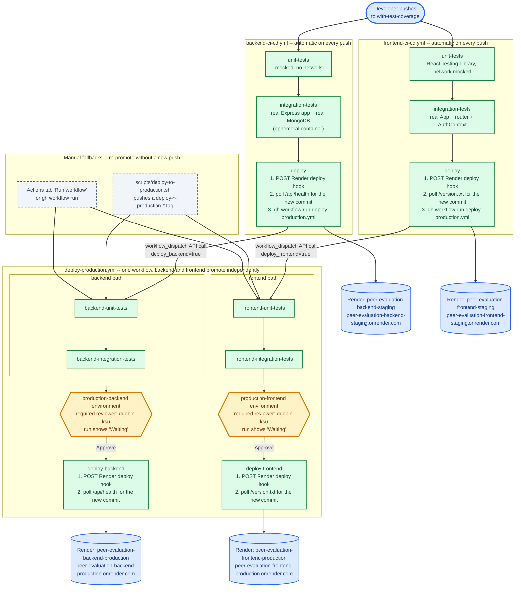

# CI/CD Pipeline

This is the actual, running pipeline on the `with-test-coverage` branch (see
`.github/workflows/` and `render.yaml`), not an aspirational sketch --
every path shown here has been executed and verified end to end.

Push to `with-test-coverage` runs the backend and frontend's own tests
independently. Passing tests deploy that app to staging automatically. The
moment staging is confirmed live, that same pipeline starts the production
pipeline for that app -- which runs the tests again and then stops, waiting
for a human to click Approve, before it deploys anything to production.
Nothing reaches production without both a passing test run and a deliberate
approval; nothing requires a human to manually run or trigger anything
except that one click.

| | Staging | Production |
|---|---|---|
| **Backend** | [peer-evaluation-backend-staging.onrender.com](https://peer-evaluation-backend-staging.onrender.com) | [peer-evaluation-backend-production.onrender.com](https://peer-evaluation-backend-production.onrender.com) |
| **Frontend** | [peer-evaluation-frontend-staging.onrender.com](https://peer-evaluation-frontend-staging.onrender.com) | [peer-evaluation-frontend-production.onrender.com](https://peer-evaluation-frontend-production.onrender.com) |

## Why it's shaped this way

- **Backend and frontend are fully independent pipelines**, from the first
  push all the way to production. A backend-only change never runs frontend
  tests or touches the frontend's production environment, and vice versa.
  This is also why `deploy-production.yml` is one workflow file with two
  parallel job chains, not two files: it lets a single push start either or
  both chains without duplicating the approval-gate logic.

- **`main` and `with-test-coverage` are deliberately kept separate** (`main`
  has its own, independently evolving CI/test setup). That ruled out the
  more obvious way to auto-chain workflows -- the `workflow_run` event --
  since GitHub only fires it for a listening workflow that exists on the
  repository's *default* branch, no exceptions. Instead, the staging
  `deploy` job calls `deploy-production.yml` itself via the workflow
  dispatch API (`gh workflow run`), which has no such restriction once a
  workflow is registered (i.e. has run at least once, via any trigger).

- **The approval gate is a GitHub Environment protection rule**, not custom
  workflow logic: `deploy-backend`/`deploy-frontend` simply declare
  `environment: production-backend` / `production-frontend`, and GitHub
  itself pauses the job and shows "Waiting" until the environment's
  required reviewer approves it in the Actions tab. Nothing reaches
  production on tests passing alone.

- **Render's own git-push auto-deploy is off on all four services.** Every
  deploy is a Render Deploy Hook call from one of these jobs, pinned to the
  exact commit that was just tested (`?ref=<sha>`) -- never whatever Render
  would otherwise build from a service's configured branch by default.

- **A static site can't report its own commit like a running server can**,
  so the frontend deploys write `RENDER_GIT_COMMIT` to `public/version.txt`
  at build time (see `render.yaml`); the backend's `/api/health` already
  exposes the same thing directly from its running process (see
  `src/backend/index.js`). Both `deploy` jobs poll their app's version
  endpoint after triggering a deploy, so "deploy succeeded" always means
  the new commit is actually the one serving traffic, not just that Render
  accepted the trigger.

See `.github/workflows/backend-ci-cd.yml`, `frontend-ci-cd.yml`, and
`deploy-production.yml` for the full, current source of truth -- their
header comments cover each of these points in more depth, plus the exact
history of what didn't work (`workflow_run`, and why `gh workflow run`
initially failed without `--repo`) before landing here.
