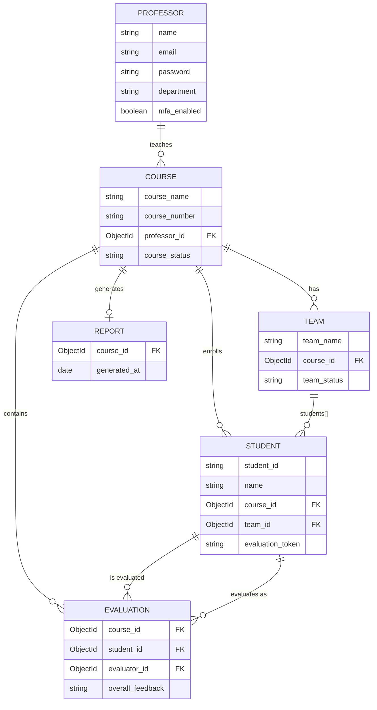

# Database Schema & External Dependencies

**Author:** Kylee Gipson (M5) — Milestone 1
**Scope:** MongoDB/Mongoose data model and every external service the backend depends on.

## Data Model

Six collections:

| Model | Purpose | Key relationships |
|---|---|---|
| Professor | Instructor account, auth, and settings | Owns many Courses |
| Course | A class section | Belongs to a Professor; has many Teams and Students |
| Team | A student grouping within a course | Belongs to a Course; references Students |
| Student | A roster entry | Belongs to a Course; optionally belongs to a Team |
| Evaluation | One peer review submission | References a Course, the Student being evaluated, and the Student submitting (evaluator) |
| Report | Aggregated results for a course | Belongs to a Course; stores summary stats and loosely-typed report data |

### Notable findings

- **Rubric criteria are hardcoded, not database-driven.** `src/backend/config/rubric.js` defines a single fixed evaluation rubric (professionalism, communication, work ethic, content knowledge/skills, overall contribution, participation), commented in the code as "the hardcoded rubric provided by sponsors." There is no Rubric model or per-course customization, despite "peer evaluation rubric management" being listed as a core workflow in the sponsor spec.
- **Team membership is tracked in two places** with no visible sync mechanism in the model files: `Team.students[]` (array of Student references) and `Student.team_id` (a reverse reference). These could drift out of sync if only one side is updated.
- **AI red-flag detection already exists at the schema level.** `Professor.aiConcerningWords` stores a large default keyword list (e.g. "harass," "discriminate," "unfair grading") used to flag concerning language in feedback. This is existing functionality to preserve, not something to build.
- **`Report.team_reports`, `student_reports`, and `ai_insights`** are typed as generic `Object`/`[Object]` with no schema enforcement, which will matter for anyone writing tests against report generation.

## External Dependencies

| Dependency | Purpose | Configured via |
|---|---|---|
| MongoDB (Atlas or local) | Primary data store | `MONGODB_URI` |
| Nodemailer / SMTP | Email invitations and notifications | `SMTP_HOST`, `SMTP_PORT`, `SMTP_USER`, `SMTP_PASS`, `SMTP_FROM` |
| Render.com | Backend and frontend hosting | Deploy config (`render-build-info.txt`) |
| jsonwebtoken + bcryptjs | Authentication (tokens, password hashing) | — |
| multer + csv-parser | Roster CSV upload | — |

`FRONTEND_URL` is also read from the environment, used to build evaluation links sent by email.

### Notable findings

- **A real `.env` file is committed to the repository**, alongside `.env.example`. If it contains live credentials, that's a credential-exposure issue worth flagging as a known defect.
- **No `JWT_SECRET` (or equivalent) appears in `.env.example`**, despite `jsonwebtoken` being a dependency. Either it's hardcoded elsewhere or undocumented — worth confirming before Milestone 2's auth testing begins.

## Data Scripts & Migrations (risk findings for defects log)

- **Only one migration script exists**: `src/backend/migrations/migrateCourses.js`, a one-time script that converted old combined `course_code` fields (e.g. "CS 4850") into the current split `course_number`/`course_section` fields and backfilled default values. There's no ongoing migration framework — schema changes going forward have no established process.
- **`src/backend/scripts/` holds 11 ad-hoc, unstructured scripts** (`addRandomCourses.js`, `createTestData.js`, `viewDatabaseContent.js`, `renameCourse.js`, etc.) for seeding test data and manually inspecting the database. There's no formal test-fixture or seeding system — this is a gap worth noting for Milestone 2's backend unit/integration test work, which will need proper fixtures rather than these manual scripts.

## Open items

- Contents of `src/backend/config/db.js` (connection setup) not yet confirmed.
- Confirm whether `JWT_SECRET` is defined and where.
