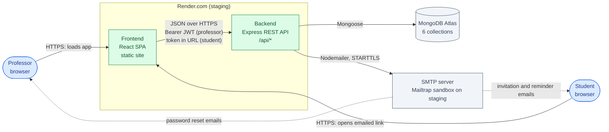
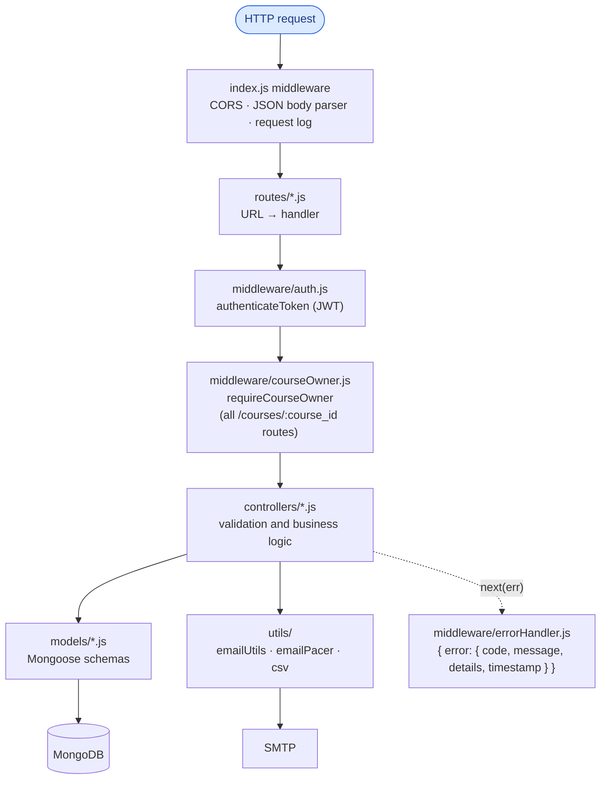
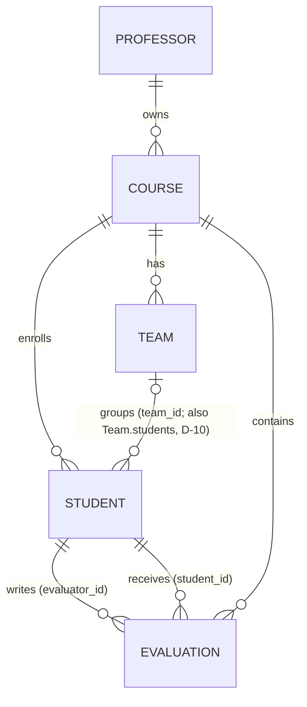
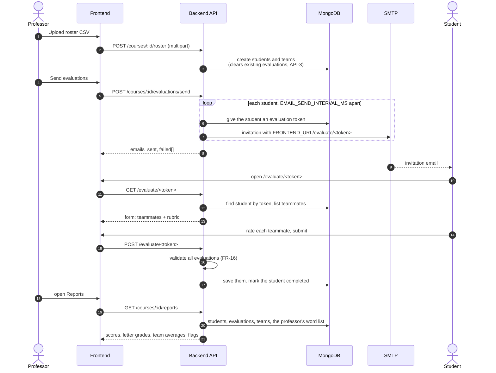
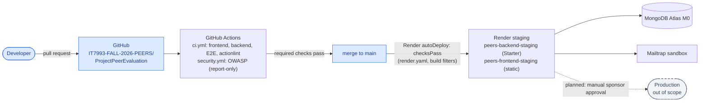

# System Architecture

**Gantt task:** Technical Assessment — *"Review software architecture & technology stack"* (M1)
**Milestone:** 1 — Assessment & Planning
**Status:** Complete for review. Describes `main` at commit `11cfd3d` (26 Sep 2026)
**Related:** [api-documentation.md](api-documentation.md) ·
[database-schema.md](database-schema.md) ·
[../research-report/tech-stack-analysis.md](../research-report/tech-stack-analysis.md) ·
[../deployment-review.md](../deployment-review.md) ·
[technical assessment report](../technical-assessment/technical-assessment-report.md) (defect IDs D-01…D-21)

PEERS is a three-tier web application: a React single-page app, an Express REST API and a
MongoDB database, plus an SMTP mail service for student invitations. Professors log in
and manage courses. Students never log in: they reach their evaluation form through a
personal link sent by email.

---

## 1. Context

| Actor | How they authenticate | What they can do |
|---|---|---|
| Professor | Email and password, then a JWT (1 hour) | Manage own courses, rosters and teams; send invitations and reminders; view and export reports; edit the concerning-words list |
| Student | Personal evaluation token in the emailed link | Open their form once, rate their teammates, submit once |

---

## 2. Frontend — `src/frontend/`

A Create React App single-page app (React 19, React Router 7, MUI 7), built to static
files and served by Render's static site with a rewrite of every path to `index.html`.

| Route (`App.js`) | Page | Access |
|---|---|---|
| `/` | `LoginPage.js` — login, registration and "forgot password" | Public |
| `/course-management` | `CourseManagement.js` — courses, roster upload, students, teams, sending invitations and reminders | Professor (`ProtectedRoute`) |
| `/reports` | `Reports.js` — grades, curved grading, team averages, flagged feedback, CSV download | Professor |
| `/settings` | `Settings.js` — the concerning-words list | Professor |
| `/evaluate/:token` | `StudentEvaluation.js` — the evaluation form | Student link |
| `/reset-password/:token` | `ResetPassword.js` — set a new password | Emailed link |

Supporting code:
- `services/api.js` — one axios client. It reads the base URL from `services/apiUrl.js`
  (`REACT_APP_API_URL` at build time, `http://localhost:5000/api` on localhost), attaches
  the JWT to every request, and waits up to 3 minutes because email sending is slow.
- `contexts/AuthContext.js` — the logged-in professor, kept in `localStorage` as `user`.
  The JWT itself is stored as `peer_eval_token`. Logout removes both.
- `components/ProtectedRoute.js` — sends a visitor without a token back to `/`. This is a
  convenience only; the API enforces access on every request.
- `services/emailResult.js` — turns the send/remind response into a success, warning or
  error message naming anyone who was missed.

`CourseManagement.js` is 2,687 lines and holds most of the professor workflow in one
component, which makes it the hardest part of the frontend to test.

---

## 3. Backend — `src/backend/`

An Express 4 application started by `index.js`. Requests pass through the same layers:

| Folder | Contents |
|---|---|
| `routes/` | `auth.js`, `courses.js` (courses and everything under a course), `evaluate.js` (student, public), `professor.js`, `ai.js` |
| `controllers/` | `authController`, `courseController`, `studentController` (roster CSV, students), `teamController`, `evaluationController` (sending, status, reminders, the student form and submission), `reportController` (scoring, curved grading, flags, CSV), `professorController` (word list), `aiController` (501 stubs) |
| `models/` | `Professor`, `Course`, `Student`, `Team`, `Evaluation`, `Report` (defined but unused). See [database-schema.md](database-schema.md) |
| `middleware/` | `auth.js`, `courseOwner.js`, `errorHandler.js` |
| `config/` | `env.js` (checks `JWT_SECRET` at startup), `health.js`, `serverTimeouts.js` (120-second keep-alive for Render's proxy), `rubric.js` (the hardcoded rubric, D-09) |
| `utils/` | `emailUtils.js` (Nodemailer transport and email templates), `emailPacer.js` (spaces emails `EMAIL_SEND_INTERVAL_MS` apart), `csv.js` (safe CSV output) |
| `scripts/`, `migrations/` | Manual seed and inspection scripts, one old migration (D-14). Not part of the running app |
| `tests/` | `node:test` unit tests, run by `npm test` and in CI |

Configuration comes from environment variables: `MONGODB_URI`, `JWT_SECRET`,
`FRONTEND_URL` (used to build emailed links), `SMTP_HOST` / `SMTP_PORT` / `SMTP_USER` /
`SMTP_PASS` / `SMTP_FROM`, `EMAIL_SEND_INTERVAL_MS`, `PORT` and `NODE_ENV`. In production
mode the app refuses to start without a `JWT_SECRET` of at least 32 characters.

The full endpoint list is in [api-documentation.md](api-documentation.md).

---

## 4. Data

Six Mongoose models in one MongoDB database (MongoDB Atlas M0 on staging, a local
`mongod` in development). Details and a diagram are in [database-schema.md](database-schema.md).

Reports are computed on each request from `Student`, `Team` and `Evaluation`; the
`Report` model is never written. The rubric lives in code (`config/rubric.js`), not in the
database.

---

## 5. Key flows

### 5.1 Professor request

1. `POST /api/auth/login` checks the bcrypt hash and returns a JWT
   (`{ id, email, name }`, 1 hour).
2. The frontend stores the token and sends `Authorization: Bearer <token>` on every call.
3. `authenticateToken` verifies it and sets `req.user`. For any `/courses/:course_id/...`
   route, `requireCourseOwner` then checks `Course.exists({ _id, professor_id: req.user.id })`
   and answers 404 if the course isn't theirs.

### 5.2 Peer evaluation cycle (the core business workflow)

Reminders (`POST .../evaluations/remind`) repeat the email loop for students who haven't
submitted. Sending happens inside the HTTP request, which is why the frontend waits up to
3 minutes (API-7).

### 5.3 Password reset

`POST /auth/reset-password` stores a random 32-byte token valid for 1 hour and emails
`FRONTEND_URL/reset-password/<token>`. `POST /auth/update-password` checks the token, saves
the new bcrypt hash and clears the token so the link works once.

---

## 6. Security model

| Concern | How it works today | Gap |
|---|---|---|
| Professor passwords | bcrypt, cost 10 | No strength rule; no rate limiting on login (API-5) |
| Professor sessions | Stateless JWT (HS256, `JWT_SECRET`), 1 hour, stored in `localStorage` | Requirement is 30 minutes (D-18); no refresh or server-side logout; `localStorage` is readable by any script on the page |
| Authorization | Every professor endpoint needs a JWT; every course-scoped endpoint checks course ownership | Student and team updates save the body as sent within the professor's own course (API-4) |
| Student access | A per-student token in the link, the only credential | Generated with `Math.random()` and never expires (API-1); submissions aren't limited to real teammates (API-2) |
| MFA | Model field and login branch exist | Verification returns 501, so MFA can't be used (D-17) |
| Transport | HTTPS on Render; SMTP over STARTTLS with certificate checking | — |
| CORS | `localhost:3000` and any `*.onrender.com` origin, credentials allowed | Broader than needed (D-13) |
| Exported data | CSV fields quoted and formula-prefixed | — |
| Dependencies | Dependabot weekly, OWASP Dependency-Check on every PR (report-only) | Frontend: 64 npm audit findings, mostly via `react-scripts` (see the tech stack analysis) |

---

## 7. Deployment and delivery

- **Local development:** `npm run setup` then `npm run dev` runs the React dev server on
  port 3000 and the API on 5000, against a local or Atlas MongoDB.
- **Staging:** `render.yaml` defines both services. The backend is a Node web service on
  the paid Starter plan, so it doesn't sleep and can reach SMTP. `/api/health` must report
  the database connected before Render switches traffic, and it reports the deployed
  commit. Build filters skip deploys for docs-only and test-only changes.
- **Production:** not hosted by this project. The approved design ends in a manual
  sponsor approval gate (Milestone 3).
- **Containers:** none yet. There is no Dockerfile, and `docker-compose.yml` describes a
  PostgreSQL setup the app doesn't use (D-05, D-06). Dockerfiles and Compose are Milestone 2
  work, and the planned CD pipeline builds images once and deploys them to Render.

The CI/CD design and status are maintained in the README's
[CI/CD Pipeline](../../README.md#cicd-pipeline) section.

---

## 8. Architecture findings

New findings from this review. Items already in the defects log keep their D-number.

| # | Finding | Impact | Suggested direction |
|---|---|---|---|
| A-1 | Email is sent synchronously inside the HTTP request, one email every `EMAIL_SEND_INTERVAL_MS` | Large classes hit the 3-minute frontend timeout (about 16 students on staging) | Queue the sends in the background and report progress; use a real email provider in production |
| A-2 | Student evaluation tokens are weak and permanent, and submissions aren't checked against the teammate list (API-1, API-2) | Grade integrity depends on these links | `crypto.randomBytes` tokens with an expiry; accept only the evaluator's own teammates, each once |
| A-3 | Uploading a roster deletes all evaluations for the course (API-3) | Silent data loss mid-cycle | Keep evaluations on upload, or ask for confirmation |
| A-4 | Team membership is stored twice (D-10) and reports rely on `Student.team_id` | The two can drift | Treat `Student.team_id` as the source of truth |
| A-5 | Most of the professor UI is one 2,687-line component | Hard to test and change safely | Split by feature when tests need it; not a rewrite |
| A-6 | Leftover placeholder files: `config/db.js`, `config/corsConfig.js`, `utils/tokenUtils.js` (one-line comments), the unused `Report` model, and the frontend `Dashboard.js` and `TeamAssignment.js` pages | Confusing; `migrations/migrateCourses.js` requires the empty `config/db.js` and can't run | Delete, and fix or retire the migration |
| A-7 | No rate limiting anywhere (API-5) | Password guessing and email flooding | Add `express-rate-limit` to auth and evaluation routes |
| A-8 | Stubs return 501: token refresh, MFA (D-17), team auto-assign, the three `/api/ai/*` endpoints | Features the UI or data model suggest don't exist | Confirm with the sponsor which are in scope |

The two most important of these for the sponsor review are **A-2** (grade integrity) and
**A-1** (email at class scale).
